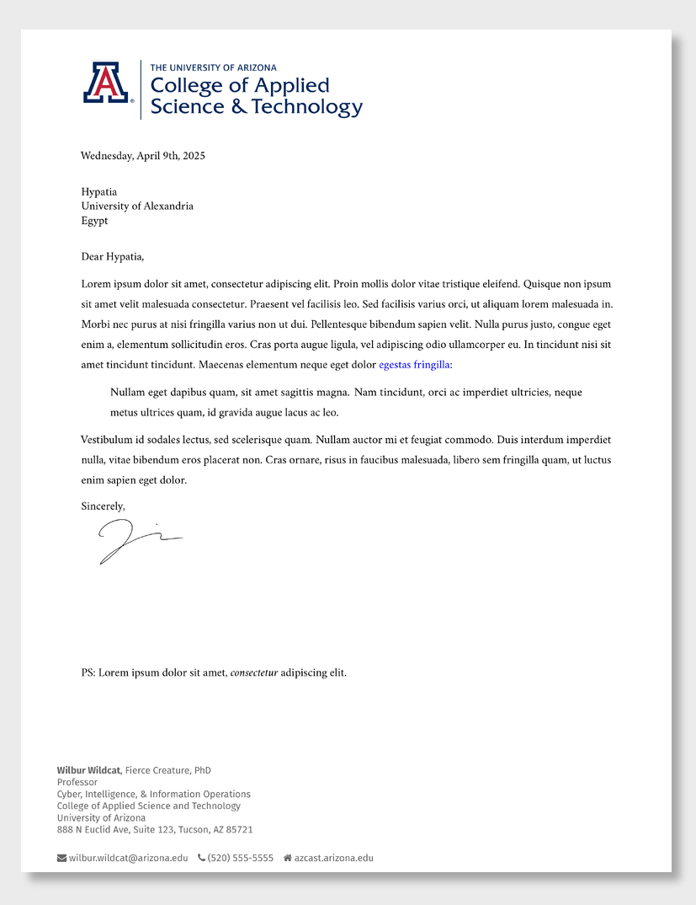

<!-- README.md is generated from README.qmd. Please edit that file -->

# CAST Letter Format Template

> Originally from the [Monash Quarto
> Letter](https://github.com/quarto-monash/letter)

This is a Quarto template that assists you in creating a letter on
letterhead for the University of Arizona’s College of Applied Science
and Technology

## Creating a new letter

You can use this as a template to create a letter. To do this, use the
following command:

``` bash
quarto use template ryanstraight/quarto-letter
```

This will install the extension and create an example qmd file that you
can use as a starting place for your letter.

## Installation for existing document

You may also use this format with an existing Quarto project or
document. From the quarto project or document directory, run the
following command to install this format:

``` bash
quarto install extension ryanstraight/quarto-letter
```

## Example

[](examples/template.pdf)
